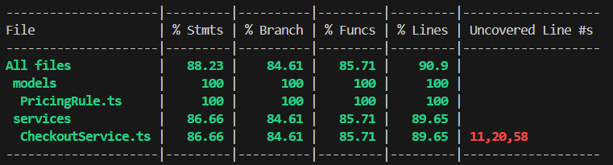

# Supermarket Checkout System

## Setup

```bash
docker-compose up --build
docker-compose exec app npm run seed --for initial data seeding, can be modified in the scripts/seed.ts folder
docker-compose exec app npm test -- for running the test cases to check if calculations are correct
docker-compose exec app npx ts-node src/index.ts -- runs the index.ts which has the code for the calculations
```

## Example to modify price in the mongo db

```bash
docker-compose exec mongo mongosh
use supermarket --name of the db
db.pricingrules.find().pretty() -- to get the current pricing
db.pricingrules.updateOne(
  { sku: "A" },
  { $set: { unitPrice: 120 } }
);

docker-compose exec app npx ts-node src/index.ts -- should give the updated result
```

##Test Coverage



